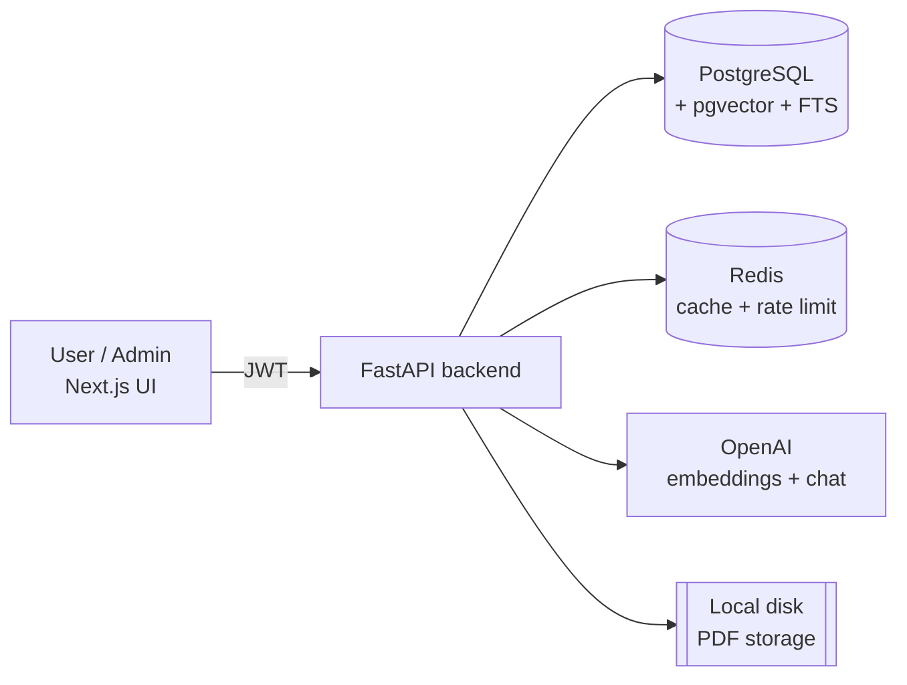
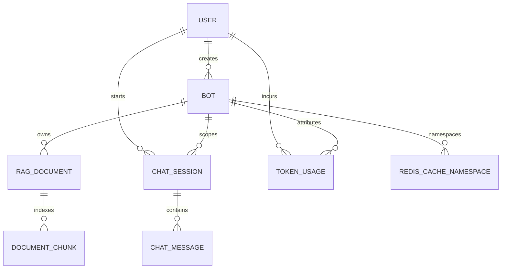
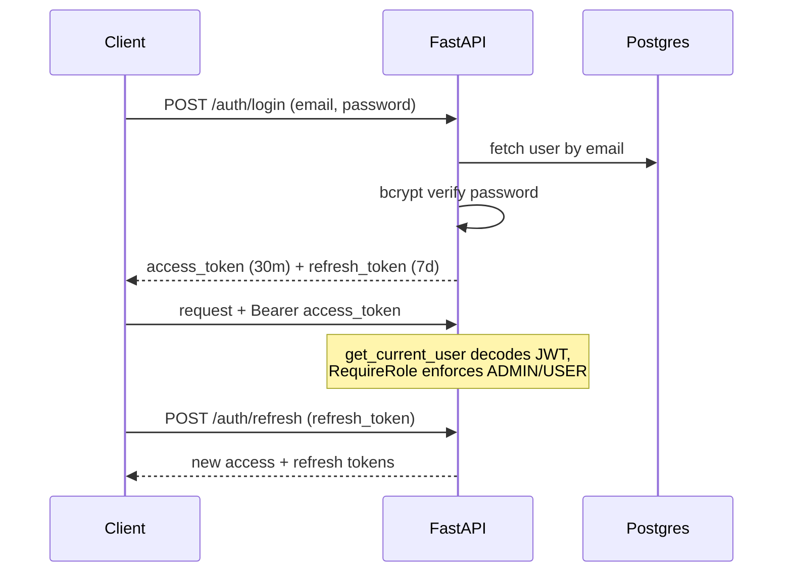
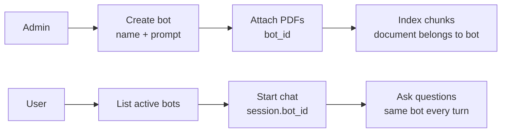
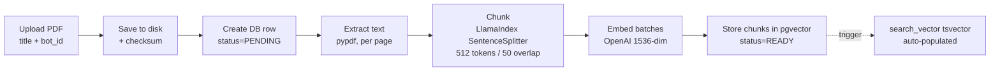
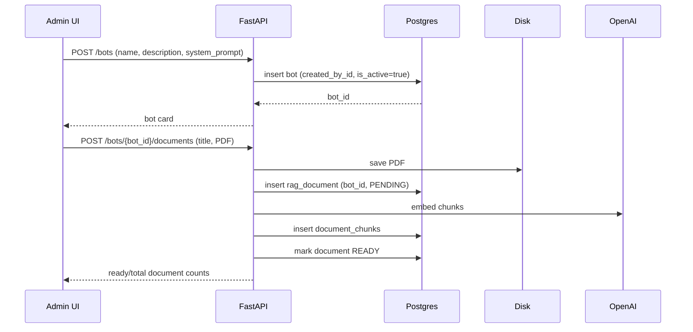
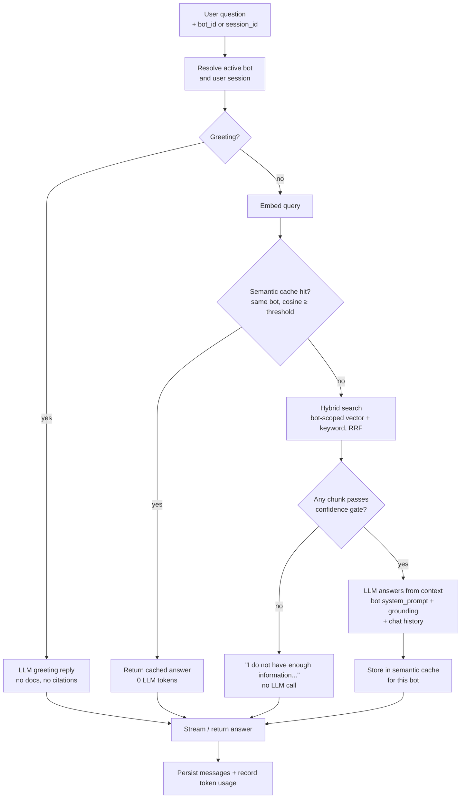
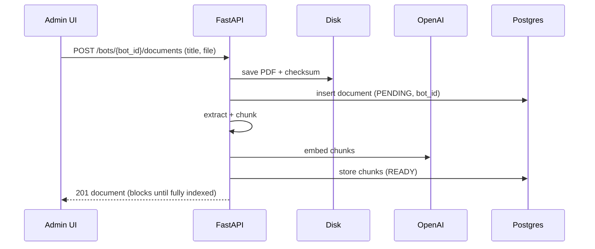
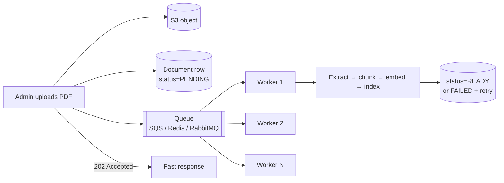

# Architecture & Functionality Guide

What each part of Ardee RAG ChatBot does, why it exists, and how it works — plus the roadmap.

For setup and commands, see [README.md](README.md).

---

## Table of contents

1. [System overview](#system-overview)
2. [Feature deep-dive](#feature-deep-dive)
   - [UUID primary keys](#1-uuid-primary-keys)
   - [Authentication & RBAC](#2-authentication--rbac)
   - [Bots (multi-knowledge-base)](#3-bots-multi-knowledge-base)
   - [Database connection pooling](#4-database-connection-pooling)
   - [Rate limiting](#5-rate-limiting)
   - [Request ID, security headers & structured logging](#6-request-id-security-headers--structured-logging)
   - [PDF storage](#7-pdf-storage)
   - [PDF ingestion pipeline](#8-pdf-ingestion-pipeline)
   - [Vector database (pgvector)](#9-vector-database-pgvector)
   - [Hybrid search (vector + keyword)](#10-hybrid-search-vector--keyword)
   - [Anti-hallucination confidence gate](#11-anti-hallucination-confidence-gate)
   - [Greeting handling](#12-greeting-handling)
   - [Redis semantic cache](#13-redis-semantic-cache)
   - [Streaming chat (SSE)](#14-streaming-chat-sse)
   - [Chat sessions & history](#15-chat-sessions--history)
   - [Metrics & token usage](#16-metrics--token-usage)
3. [End-to-end workflows](#end-to-end-workflows)
4. [Multi-bot architecture invariants](#multi-bot-architecture-invariants)
5. [Configuration reference (thresholds)](#configuration-reference-thresholds)
6. [Scope of improvement](#scope-of-improvement)

---

## System overview

The product is organized around **bots**. Each bot has its own system prompt (persona) and PDF knowledge base. Retrieval, chat sessions, semantic cache, and token usage are all **scoped to a bot**, so answers never mix documents across assistants.

The backend is layered: **routes → services → repositories → models**. Cross-cutting concerns (auth, rate limit, request-id, security headers, metrics, logging) live in middleware/core so business logic stays clean and testable.

At a high level, the multi-bot data model looks like this:

`Bot` is the tenant-like boundary for RAG behavior. A user account can chat with many bots, but a single chat session belongs to exactly one bot. Admins can create as many bots as needed, attach a different PDF set to each one, and tune each bot's system prompt without affecting the others.

---

## Feature deep-dive

### 1. UUID primary keys

- **What:** Every table uses a UUID primary key (`gen_random_uuid()`), not an auto-incrementing integer.
- **Benefit:**
  - **No enumeration** — clients can't guess `/documents/2` after seeing `/documents/1`.
  - **Merge-safe / shardable** — IDs are globally unique across environments.
  - IDs can be generated client- or server-side without a round trip.
- **How:** Defined once on the SQLAlchemy `Base`, inherited by all models.

### 2. Authentication & RBAC

- **What:** JWT-based auth with short-lived **access tokens** + long-lived **refresh tokens**, bcrypt-hashed passwords, and two roles (`ADMIN`, `USER`).
- **Benefit:**
  - **Stateless auth** — the API scales horizontally with no server-side session store.
  - **Short access-token TTL** limits the blast radius of a leaked token; refresh tokens keep UX smooth.
  - **RBAC** separates admin capabilities (bots, PDFs, metrics) from user capabilities (chat, own usage).
  - Tokens embed the display name, so the UI shows who's signed in without an extra call.
- **Workflow:**

### 3. Bots (multi-knowledge-base)

- **What:** An admin-configured assistant with a `name`, optional `description`, `system_prompt`, active/inactive status, and a set of PDF documents. Users list and chat with active bots; only admins create/update/delete bots and manage knowledge-base PDFs.
- **Benefit:**
  - One deployment can host many assistants (HR handbook, product docs, support FAQ) without cross-contamination.
  - Per-bot system prompts let each assistant have a distinct persona and instructions; shared grounding rules are appended at answer time.
  - Bot-level document counts (`document_count`, `ready_document_count`) make it obvious whether a bot is ready to answer.
  - Soft-delete hides a bot from normal use without destroying historical usage attribution.
- **Lifecycle:**
  - Create: admin provides name, description, and system prompt.
  - Manage: admin edits prompt/status and uploads, renames, replaces, or deletes PDFs for that bot.
  - Chat: users select one bot; a new session stores that bot's `bot_id`.
  - Continue: later messages infer the bot from the existing session, so the conversation cannot silently switch assistants.
  - Delete/deactivate: inactive or deleted bots are no longer available for chat; usage history remains useful for reporting.
- **Scoping:** Documents, hybrid search, chat sessions, and token-usage rows carry a `bot_id`; Redis semantic cache keys are namespaced by `bot_id`.
- **Frontend:** `/bots` is the home after login. Users open `/bots/{botId}` to chat; admins manage prompt + PDFs at `/bots/{botId}/manage`. The admin console (`/admin`) is metrics-focused.

The important design choice is that a bot is not just a UI grouping. It is carried through persistence, retrieval, prompt construction, caching, and metrics.

### 4. Database connection pooling

- **What:** A single async SQLAlchemy engine with a bounded connection pool (`pool_size=20`, `max_overflow=10`, `pool_timeout=30`, `pool_recycle=3600`, `pool_pre_ping=True`).
- **Benefit:**
  - **Reuses** established connections instead of paying TCP+auth cost per request.
  - **Bounded** so a traffic spike can't open thousands of connections and exhaust Postgres.
  - `pool_pre_ping` drops dead connections; `pool_recycle` avoids stale ones.
- **How:** Created once at startup (lifespan), disposed at shutdown; sessions are handed to requests via a FastAPI dependency that commits on success and rolls back on error.

### 5. Rate limiting

- **What:** Redis-backed per-identity rate limiting (default **60 requests/minute**) as middleware.
- **Benefit:** Protects the API and the (paid) OpenAI backend from abuse and accidental loops. Redis-backed so the limit is consistent across multiple app instances.
- **How:** A counter keyed by client identity with a rolling window; over-limit requests get `429`.

### 6. Request ID, security headers & structured logging

- **What:** Every request gets an `X-Request-ID` (generated or propagated); responses carry security headers; logs are structured (structlog).
- **Benefit:**
  - **Traceability** — one request ID ties HTTP, business, and SQL logs together.
  - Machine-parseable logs (JSON in production) feed log aggregation.
  - Security headers reduce common web risks (clickjacking, MIME sniffing, etc.).

### 7. PDF storage

- **What:** Uploaded PDFs are saved to the **local filesystem** (`backend/storage/uploads/rag`), with a SHA-256 checksum, size, and content-type recorded in Postgres. Each document belongs to a bot (`bot_id`).
- **Benefit today:** Simple, dependency-free, and fine for a single instance or a Docker volume.
- **Multi-bot behavior:** The same PDF checksum can exist in different bots, but duplicate active uploads are blocked within the same bot. That lets two assistants reuse the same source file when intentional, while preventing accidental duplicate indexing inside one assistant.
- **Limitation:** Local disk isn't durable or shared across instances — see [Scope of improvement](#scope-of-improvement) (move to S3).

### 8. PDF ingestion pipeline

- **What:** Turns an uploaded PDF into searchable, embedded chunks scoped to its bot.
- **Benefit:** Small, semantically coherent units with page numbers, so answers can cite exactly where information came from.
- **Multi-bot behavior:** Chunks do not need their own `bot_id`; they inherit bot scope through `document_id → rag_documents.bot_id`. Retrieval joins through the document and filters on the selected bot.
- **Workflow (synchronous, inside the upload request):**

- A DB trigger keeps each chunk's full-text `search_vector` in sync, so keyword search needs no extra ingestion code.
- Upload paths: `POST /bots/{bot_id}/documents` or `POST /rag/documents` (requires `bot_id` form field).
- **Replace** re-runs the pipeline, bumps the document `version`, and clears that bot's semantic cache; **delete** is a soft delete plus physical file removal and also clears that bot's cache.

### 9. Vector database (pgvector)

- **What:** Chunk embeddings (1536-dim) are stored in a Postgres `vector` column with an **HNSW** index (`m=16`, `ef_construction=64`, cosine ops).
- **Benefit:**
  - **One database** for relational data and vector search — no separate vector store to operate or keep consistent.
  - HNSW gives fast approximate nearest-neighbor search.
  - Cosine similarity = `1 - (embedding <=> query)`.
- **Multi-bot behavior:** Vector search joins chunk → document and applies `rag_documents.bot_id = selected_bot_id`, so the HNSW-backed candidate set is restricted to one bot's knowledge base.

### 10. Hybrid search (vector + keyword)

- **What:** Retrieval fuses **semantic** search (pgvector cosine) with **lexical** search (Postgres full-text `ts_rank_cd` over `search_vector`) using **Reciprocal Rank Fusion**, filtered to the selected bot's documents.
- **Benefit:**
  - Vector search catches *meaning*; keyword search catches exact terms, acronyms, names, and codes.
  - **RRF** (`score = 1/(60 + rank)` summed across both) needs no score normalization.
- **Workflow:**

```mermaid
flowchart TB
    Q[Query + bot_id] --> V[Vector candidates<br/>ORDER BY embedding &lt;=&gt; q]
    Q --> K[Keyword candidates<br/>ts_rank_cd on search_vector]
    V --> F[RRF fuse<br/>1/&#40;60+rank&#41; each, sum]
    K --> F
    F --> T[Top-K by hybrid score<br/>keeps real vector & keyword scores]
```

- If the query has no valid `tsquery` terms, keyword search is empty and retrieval falls back to vector-only.

### 11. Anti-hallucination confidence gate

- **What:** After fusion, a chunk only counts as usable evidence if `vector_score ≥ rag_min_vector_score` **OR** `keyword_score ≥ rag_min_keyword_score`. If **nothing** qualifies, the LLM is **never called** and the bot returns exactly:
  `"I do not have enough information in the uploaded documents to answer this question."`
- **Benefit:**
  - **Two-layer safety:** the gate blocks answering from irrelevant context; grounding instructions appended to the bot's system prompt also tell the model to refuse when context is insufficient.
  - Saves tokens/latency on out-of-scope questions and prevents confident-but-wrong answers.

### 12. Greeting handling

- **What:** A lightweight, deterministic classifier detects greetings / small talk ("hi", "good morning", "thanks a lot"). Those get a short, friendly **LLM** reply with **no citations**; everything else goes through document retrieval.
- **Benefit:**
  - Natural UX — the bot doesn't reply "I don't have enough information" to "hello".
  - **Rule-based on purpose:** instant, free, and cannot hallucinate the routing decision.
  - Mixed messages like *"hi, what is attention?"* are treated as real questions.

### 13. Redis semantic cache

- **What:** Answers are cached by the **meaning** of the question, **namespaced per bot**. A new query's embedding is compared to that bot's cached embeddings; cosine similarity ≥ threshold is a hit (default TTL 1 hour).
- **Benefit:**
  - Repeated or reworded questions return instantly with zero LLM cost within the same bot.
  - Different bots never share cache hits, even for identical questions.
- **How:** Checked before generation; each chat response reports `semantic_cache_hit` and the similarity score.

### 14. Streaming chat (SSE)

- **What:** `POST /chat/ask/stream` returns **Server-Sent Events**: a `meta` event (session id), then `token` events as the model generates, then a `done` event with the final answer, citations, and token usage.
- **Benefit:**
  - Perceived latency drops — users see words appear immediately.
  - Citations and usage arrive in the terminal `done` event.
- **How:** Persistence + token accounting commit before `done`; a mid-stream failure rolls back so a question is never stored without its answer. Blocking `POST /chat/ask` shares the same prepare path (resolve bot/session → greeting → cache → retrieve → gate → generate).

### 15. Chat sessions & history

- **What:** Conversations are grouped into sessions belonging to a user **and** a bot. New sessions require `bot_id`; continuing a session reuses the session's bot. The last *K* turns are fed back into each prompt. Users can **rename** and **delete** their own sessions.
- **Benefit:**
  - Multi-turn context makes follow-ups work naturally within one bot.
  - A session cannot drift across bots: if `session_id` is present, the backend ignores any competing `bot_id` and loads the bot from `chat_sessions.bot_id`.
  - Owner-scoped management keeps history private.
  - Deleting a session nulls the token-usage FK so **usage metrics stay accurate** after cleanup.

### 16. Metrics & token usage

- **What:** Every chat request records input/output/embedding tokens with `user_id`, `bot_id`, optional `session_id`, and optional `message_id`. Admins see **per-user** usage, **per-bot** usage, and a **daily** time series (filterable by user or bot). Each user sees their own total and per-session usage. Prometheus metrics are exposed at `/api/v1/metrics`.
- **Benefit:** Cost visibility and attribution by person and by assistant; Prometheus format plugs into Grafana/alerting.

---

## End-to-end workflows

### Admin creates and prepares a bot

Only `READY` documents produce chunks that are useful for retrieval. The bot card shows total and ready document counts so admins can see whether a bot has usable knowledge.

### RAG query (the heart of the app)

For a new chat, the request must include `bot_id`. For an existing chat, the request includes `session_id`; the backend loads the session and uses its stored `bot_id`. That rule keeps follow-up questions attached to the bot that started the conversation.

### Admin PDF upload (current, synchronous)

> The upload request **blocks** until extraction, embedding, and indexing finish. See [Scope of improvement](#scope-of-improvement) for the async version.

---

## Multi-bot architecture invariants

These rules keep assistants isolated from one another:

| Area | Invariant |
|---|---|
| Bot listing | Normal users see active, non-deleted bots; admin-only routes create/update/delete bots. |
| Documents | Every uploaded PDF is attached to one bot with `rag_documents.bot_id`. |
| Chunks | Chunks inherit bot scope through their document; retrieval never searches chunks without joining through the owning document. |
| Search | Vector, keyword, and hybrid retrieval all require the selected `bot_id`. |
| Prompting | The LLM receives the selected bot's `system_prompt` plus shared grounding instructions. |
| Sessions | New sessions require `bot_id`; existing sessions reuse `chat_sessions.bot_id`. |
| Cache | Semantic cache entries are namespaced by bot; document replace/delete clears only that bot's cache. |
| Citations | Citations point to chunks/documents from the selected bot's knowledge base. |
| Usage | Token usage is attributed to both the user and the bot for per-user/per-bot reporting. |
| Deletion | Soft-deleted or inactive bots cannot be selected for chat, while historical usage remains reportable. |

The practical effect: two bots can contain different PDFs, different prompts, and different cached answers even when users ask the same words. A support bot and an HR bot can both receive "What is the refund policy?" and produce isolated answers based only on their own documents.

---

## Configuration reference (thresholds)

Code defaults from `Settings` (environment variables override; see `.env.example`):

| Setting | Default | Meaning |
|---|---|---|
| `rag_min_vector_score` | **0.25** | Min cosine similarity for a chunk to count as relevant |
| `rag_min_keyword_score` | **0.1** | Min `ts_rank_cd` score that also qualifies a chunk |
| RRF constant `k` | **60** | Damping in `1/(k + rank)` |
| `rag_top_k` | **5** (UI often sends **3**) | Chunks returned to the LLM |
| `semantic_cache_threshold` | **0.95** | Cosine similarity for a cache hit |
| `semantic_cache_ttl_seconds` | **3600** | Cache entry lifetime |
| `rag_chunk_size` / `rag_chunk_overlap` | **512 / 50** | Chunk tokens / overlap |
| `chat_history_messages_limit` | **10** | Prior messages included in the prompt |
| `openai_embedding_dimensions` | **1536** | Embedding vector size |
| HNSW `m` / `ef_construction` | **16 / 64** | pgvector index build params |
| `pool_size` / `max_overflow` | **20 / 10** | DB connection pool |
| `rate_limit_per_minute` | **60** | Requests/min per identity |
| `jwt_access_token_expire_minutes` | **30** | Access-token TTL |
| `jwt_refresh_token_expire_days` | **7** | Refresh-token TTL |

> The keyword ranker is PostgreSQL full-text `ts_rank_cd` (cover-density), **not BM25**. Its scores are on a different scale than cosine — hence the different threshold.

---

## Scope of improvement

### 1. Object storage (S3) instead of local disk

**Today:** PDFs live on the app's local filesystem, so storage isn't durable, isn't shared across instances, and grows the container/host.

**Target:** Upload PDFs to **Amazon S3** (or any S3-compatible store). Postgres keeps only the object key + metadata; downloads/re-processing stream from S3.

**Benefits:** durability, unlimited capacity, shared across every app instance, lifecycle policies, and optional CDN.

### 2. Asynchronous ingestion with a queue + workers

**Today:** Upload is **synchronous** — the admin waits while the file is extracted, chunked, embedded, and indexed. Large PDFs make the request slow, tie up a web worker, and a transient OpenAI error fails the whole upload with no retry.

**Target:** Decouple upload from processing.

**How:** On upload, store the file in S3, create a `PENDING` row, enqueue a job, and return **`202 Accepted` immediately**. Workers (e.g. Celery / RQ / Arq / Dramatiq) run extract → chunk → embed → index and update status to `READY` or `FAILED`.

**Benefits:** instant upload response; retries with backoff; independent scaling of ingestion vs the web tier.

### 3. Other roadmap items

- **Retrieval quality:** cross-encoder **re-ranker** over hybrid candidates; optionally true **BM25** via ParadeDB `pg_search`; tune HNSW `ef_search`.
- **Model flexibility:** provider-agnostic embedding/LLM layer (Azure OpenAI, Bedrock, local models) via configuration.
- **Observability:** ship structured logs to a store, add OpenTelemetry tracing, Grafana dashboards over Prometheus metrics.
- **Delivery:** CI/CD (lint, type-check, tests, image build/scan), automated migrations, blue-green/canary deploys.
- **Security/ops:** secret manager + rotation, TLS at the edge, managed Postgres/Redis, backup & restore runbooks.
- **Scale/UX:** WebSocket transport option, citation click-through to the source page, soft-delete/restore UI for documents.
